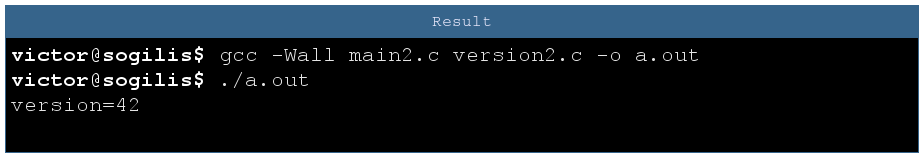
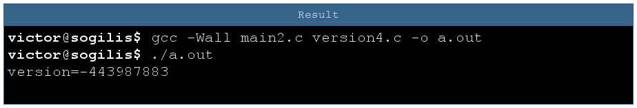
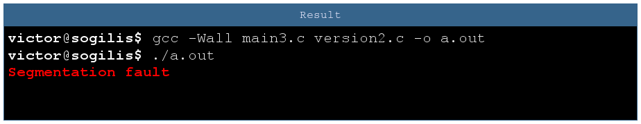
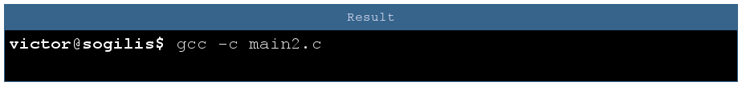
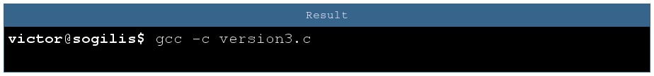
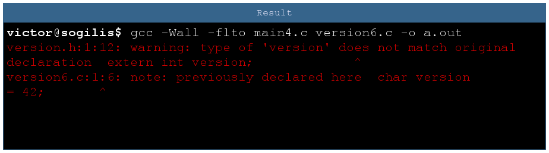
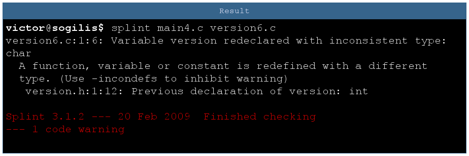

#Compiling & Dangerous

C is not a strong typed language but it can run some basic checks. Knowing that, C developers are generally careful because debugging type problems is annoying and can be limited with some simple good practices.

Sometimes a bored developer tries something bold, something new. Here we will detail one of these experiments I recently encountered in a legacy project: **what if we use the `extern` keyword without headers?**

It's uncommon but maybe it's not that bad? Let's see...

##Test program


We start from here, a simple program printing his version number. `version` is declared in main file and defined in version file.

I ensure that both declaration and definition are of the same type. Anyway, if something is wrong the compiler will at least raise a warning, right?

##I can't C any problem here




To test this I modified version to pass version type from `int` to `char`. There is no complaint from compiler and the version number is correct so obsiously my code is not broken [^1]

[^1]: for the purpose of this article, let's pretend I'm **that** naive

##A charity problem


As the previous program is not bugged I can continue my work, let's add a simple `char ET` in version. Wait, what happens with my version number?

The answer is simple: due to type difference main is reading an `int` of 4 bytes but `version` is defined as char so it is a single byte long. In previous program due to luck the 3 bytes in excess were containing zeroes so the problem was not detected. Simply by adding a new variable we modified one of those bytes and so increased the version number by 256.

We have to fix that. A good practice is to hide implementation with a function call, let's try it!

##Is half a good practice still a good practice?




Though I refactored with a function exactly like this stackoverflow thread said, I still get a version number that is complete non-sense.

Well there is a tiny problem: I forgot to update the `main` so the extern declaration is still an int. The version number printed here is the address of the `version` function.




For curiosity sake let's make the mirror mistake. Here the program is segfaulting because we're calling the function at adress 42. As 42 is near 0 it's in a non valid memory range and OS raised a segfault. With a different value it might call a valid function, possibly doing something really wrong.

##Understanding the problem

By using the `extern` mechanism you tell the compiler: I declared something that's defined elsewhere, you will find at link time. It's problematic for type verification as linker works basically with symbol names and addresses. All type related information is forgotten at this time.

It can be verified by looking at object files:

```


victor@sogilis$ readelf -s main2.o version3.o
File: main2.o
Num   :    Value          Size Type    Bind   Vis      Ndx Name
10    : 0000000000000000     0 NOTYPE  GLOBAL DEFAULT  UND version

File: version3.o
Num:    Value          Size Type    Bind   Vis      Ndx Name
7: 0000000000000000     1 OBJECT  GLOBAL DEFAULT    2 version
```

We can see that in `main2.o` `version` size is 0 and has `NOTYPE`.

#Fixing the issue

What I would consider a fix is any mechanism allowing to detect a type mismatch. There are several ways to do that.

##Clean fix


This fix is so obvious I'm sure it's a reflex for almost every C developer. If a module defines an extern variable then this variable is part of the module public interface and should be declared in the header.


Important note: sometimes you can encounter some C code where a module does not include its own header. As we can see with this example, the type conflict is not detected.

The reason is simple: a C definition is also a declaration. So `version5.c` contains two declarations: one in the header and one in the C file, while `version6.c` is compiled without header and there is a single declaration. It's easier to be consistent when you're alone.

##The hostile environment fix

When you have a code base already corrupted with bad extern usage, you just can't fix it in a instant. First you would like to detect if there are type bugs you have not yet detected with your tests.

It's possible thanks to the `-ftlo` option (for link-time optimizer). With this option the compiler adds metadata about the objects and the linker uses them to perform several optimizations. As the metadata contains the object types, the linker also raises a warning if there is a confusion. To quote documentation:

> if LTO encounters objects with C linkage declared with incompatible types in separate translation units to be linked together (undefined behavior according to ISO C99 6.2.7), a non-fatal diagnostic may be issued.



##Use an extern tool to detect extern issues, it's logical!

With a code static analyzer like `splint` you can detect this kind of problem:



#Conclusion

Without this legacy project I would never have explored that far how much damage can be done in this situation. It remembers us, C developers what a dangerous language we're using, and how much special and perfect we are to make it work.

Let's leave the final word to a specialist:

> Christ, people. Learn C, instead of just stringing random characters
> together until it compiles (with warnings).
>                                        Linus Torvalds
